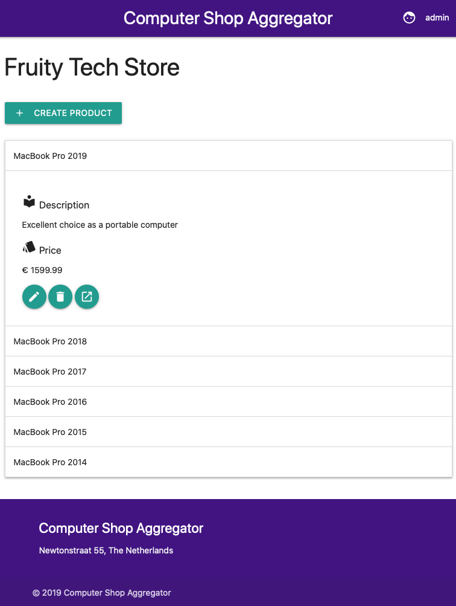

# Udacity Item Catalog Project
This is a project for the Udacity Full Stack Web Developer Nanodegree program. For the purpose of this application, a computer shop aggregation site has been created in which users can add their shops and their products.


## Overview
The goal of the project is to create a stateful web application which displays a list of items within categories. User registration and authenticaiton by means of OAuth is also a part of the application. Registered users are allowed to perform CRUD actions on their own items.

The used technolgies for this project are:
* git
* Python 3.5
* Flask
* [Flask-OAuthlib](https://flask-oauthlib.readthedocs.io/en/latest/index.html)
* [SQLAlchemy](https://www.sqlalchemy.org)
* [MaterializeCSS](https://materializecss.com)

## Executing the project
In order to execute the project, we need to go through a couple of steps

### 1. Install Virtualbox and Vagrant
Make sure to first install [Virtualbox](https://www.virtualbox.org/wiki/Download_Old_Builds_5_1) and [Vagrant](https://www.vagrantup.com/downloads.html). 

### 2. Set up VM with configuration of Udacity and git repository
The configuration of Udacity called [FSND-Virtual-Machine.zip](https://s3.amazonaws.com/video.udacity-data.com/topher/2018/April/5acfbfa3_fsnd-virtual-machine/fsnd-virtual-machine.zip), needs to be downloaded. 
Change into this directory after you've unzipped the directory. Find a folder called Vagrant and `cd` into this directory. 
Afterwards, do a git clone of my repository into this folder so that my project folder is inside this Vagrant folder. 

### 3. Start up virtual machine
Start up the virtual machine by running the command `vagrant up`. After running `vagrant up`, run `vagrant ssh` to login
to the virtual machine. 

Navigate into the shared directory containing the repo with
```bash
cd /vagrant/udacity-item-catalog
```

## 4. Dependencies
This project needs some dependencies to be installed. These can be installed by running the following command:
```bash
sudo pip3 install -r requirements.txt
```


### 5. Load the data into the database
We need to set up a mock database containing mock data. This can be done as follows:
```bash
python3 database_initializer.py
```

### 6. Set up twitter `consumer_key` and `consumer_secret`
In the file `project.py`, the following two lines contain placeholder values for the twitter `consumer_key` and `consumer_secret`:
```python
consumer_key='YOUR_CONSUMER_KEY',
consumer_secret='YOUR_CONSUMER_SECRET'
```
If you want to test Sign in with Twitter, make sure to replace these two values with the given consumer key and secret, during submission.

### 7. Start the flask application
After execxuting the prerequisites, we can start up the application with the following command:
```python
python3 project.py
```
Go to your browser and load http://localhost:5000. A page will be loaded with some example shops. You can sign in with the default user which has the following credentials
```
username: admin
password: admin
``` 
It's also possible to sign in with your Twitter account. 
